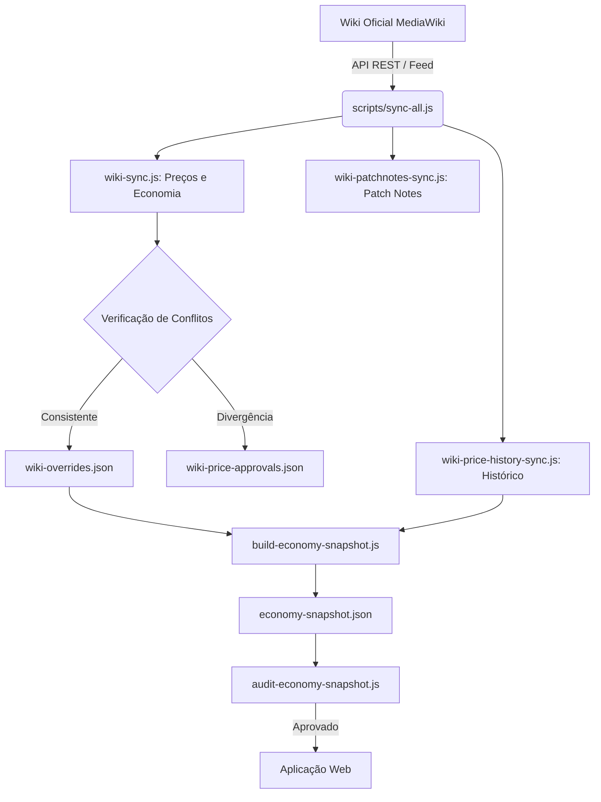

# AureumRO - Database & Radar Econômico

<div align="center">

**Base de dados, simulador de combate, montador de builds, otimização de farm e monitoramento econômico para o servidor AureumRO.**

[](https://github.com/marlonhms/ROData)
[](https://github.com/marlonhms/ROData)
[](LICENSE)

[Radar Econômico](#radar-econômico) • [Modelagem Matemática](#modelagem-matemática) • [Personagem e Combate](#personagem-builds-e-combate) • [Otimização de Farm](#otimização-de-farm) • [Base de Dados](#base-de-dados) • [Pipeline Wiki](#pipeline-de-dados-e-sincronização-wiki) • [Como Rodar](#como-executar-localmente)

</div>

---

## Sobre o Projeto

O AureumRO Database reúne em uma única aplicação web catálogo completo do jogo, ferramentas táticas de combate, montador de builds com motor de efeitos e um módulo analítico de economia.

O sistema cruza dados brutos de spawns (`db.json`), tabelas de drop e alterações de preços da Wiki oficial (`wiki-overrides.json`, `price-history.json`) para calcular a capacidade estrutural de emissão de Zeny do servidor e simular cenários de combate e farm com dados reais.

---

## Radar Econômico

O Radar Econômico calcula o peso de geração de Raw Zeny com base nos monstros que nascem em cada mapa e nos itens vendidos em NPCs.

O módulo atende tanto jogadores em busca de rotas de farm sustentáveis quanto administradores que precisam monitorar o balanceamento da economia:

1. **Pressão de Raw Zeny:** Identifica quais itens e mapas mais injetam moeda no servidor.
2. **Avaliação de Risco:** Aponta quais itens possuem preço estável e quais estão com geração desproporcional.
3. **Concentração:** Mede a dependência da economia em relação aos principais drops e mapas.
4. **Posição Patrimonial:** Calcula a fatia do patrimônio do jogador em relação ao Zeny total em circulação.
5. **Cenários Preditivos:** Projeta variações a 7 e 30 dias com base na série histórica de revisões de preço.

```
 ┌─────────────────────────────────────────────────────────────────────────────┐
 │                         FLUXO DE DADOS DA ECONOMIA                          │
 ├─────────────────┬──────────────────────┬─────────────────┬──────────────────┤
 │ Spawns e Drops  │  Preços NPC e Wiki   │ Massa de Zeny   │ Histórico Wiki   │
 │ (db.json)       │ (wiki-overrides.json)│ (API / Snapshot)│ (Revisões rN)    │
 └────────┬────────┴──────────┬───────────┴────────┬────────┴─────────┬────────┘
          │                   │                    │                  │
          ▼                   ▼                    ▼                  ▼
 ┌─────────────────────────────────────────────────────────────────────────────┐
 │                         MOTOR DE CÁLCULO ESTATÍSTICO                        │
 │   * Peso de Oferta Global       * Concentração HHI                          │
 │   * Pressão de Emissão          * Score de Risco de Revisão                 │
 │   * Mediana de Choques          * Projeções (3 Cenários)                    │
 └──────────────────────────────────────┬──────────────────────────────────────┘
                                        │
                                        ▼
 ┌─────────────────────────────────────────────────────────────────────────────┐
 │                              PAINEL DO JOGADOR                              │
 │   * Farm Seguro   * Alerta de Risco   * Mercado P2P   * Simulador de Zeny   │
 └─────────────────────────────────────────────────────────────────────────────┘
```

---

## Modelagem Matemática

Todos os cálculos são determinísticos e validados pelo script de auditoria (`scripts/audit-economy-snapshot.js`).

### 1. Peso de Oferta e Pressão de Emissão

Para cada item $i$, o peso de oferta ($\text{SupplyWeight}_i$) corresponde à soma da chance de drop multiplicada pela quantidade de monstros que nascem em todos os mapas (excluindo MVPs):

$$\text{SupplyWeight}_i = \sum_{m \in \text{Mobs}} \left( \text{Chance}_{m, i} \times \sum_{k \in \text{Mapas}} \text{Spawn}_{m, k} \right)$$

A contribuição bruta de emissão ($\text{RawContribution}_i$) indica a pressão em Zeny do item:

$$\text{RawContribution}_i = \text{PreçoNPC}_i \times \text{SupplyWeight}_i$$

A participação percentual de um item sobre a emissão total ($\text{SharePct}_i$) é dada por:

$$\text{SharePct}_i = \frac{\text{RawContribution}_i}{\sum_{j} \text{RawContribution}_j} \times 100$$

---

### 2. Concentração Econômica (Índice HHI)

O índice de Herfindahl-Hirschman (HHI) calcula o nível de concentração da geração de Zeny em poucos itens ou mapas:

$$HHI = \sum_{i=1}^{N} \left( \frac{\text{RawContribution}_i}{\text{TotalContribution}} \times 100 \right)^2$$

* **Alta Concentração ($HHI \ge 2.500$):** Emissão concentrada em poucos spots.
* **Concentração Moderada ($1.500 \le HHI \lt 2.500$):** Distribuição intermediária com polos definidos de farm.
* **Distribuída ($HHI \lt 1.500$):** Geração distribuída entre múltiplos mapas e monstros.

---

### 3. Score de Risco de Revisão (Review Pressure)

Para identificar itens com pressão desbalanceada de emissão, o cálculo combina quatro componentes normalizados:

$$\begin{aligned}
S_{\text{pressão}} &= \sqrt{\frac{\text{RawContribution}_i}{\max(\text{RawContribution})}} \times 100 \\
S_{\text{oferta}} &= \sqrt{\frac{\text{SupplyWeight}_i}{\max(\text{SupplyWeight})}} \times 100 \\
S_{\text{histórico}} &= \min\left(100, \text{AlteraçõesPassadas}_i \times 45\right) \\
S_{\text{preço}} &= \frac{\ln(1 + \text{PreçoNPC}_i)}{\ln(1 + \max(\text{PreçoNPC}))} \times 100
\end{aligned}$$

A pontuação final ($\text{Score}_i \in [0, 100]$) é calculada por:

$$\text{Score}_i = 0{,}45 \cdot S_{\text{pressão}} + 0{,}25 \cdot S_{\text{oferta}} + 0{,}20 \cdot S_{\text{histórico}} + 0{,}10 \cdot S_{\text{preço}}$$

Classificação aplicada:
* **Farm Seguro ($\text{Score} \lt 50$):** Itens estáveis com baixo risco de reajuste em revisões da Wiki.
* **Monitorada ($50 \le \text{Score} \lt 65$):** Itens com geração moderada a alta, sujeitos a acompanhamento.
* **Alerta de Risco ($\text{Score} \ge 65$):** Itens com volume de emissão muito acima da média do servidor.

---

### 4. Projeções e Cenários (Forecast a 7 e 30 Dias)

O modelo calcula a mediana das variações negativas nas revisões anteriores de preço ($\text{ChoqueMediano}$):

$$\text{ChoqueMediano} = \text{mediana}\left(\Delta_i \mid \Delta_i \lt 0\right)$$

Com base na cadência observada de atualizações, são projetados três cenários:

| Cenário | Direção | Premissa | D+7 | D+30 |
| :--- | :---: | :--- | :---: | :---: |
| **Restritivo** | Queda | Reajuste nos itens líderes equivalente à mediana dos ajustes históricos | $I_0 \cdot \left(1 + \frac{\text{ChoqueMediano}}{200}\right)$ | $I_0 \cdot \left(1 + \frac{\text{ChoqueMediano}}{100}\right)$ |
| **Neutro** | Estável | Manutenção dos valores vigentes de venda em NPC | $I_0$ | $I_0$ |
| **Expansionista** | Alta | Aumento na oferta ou valorização de subprodutos | $I_0 \cdot \left(1 + \frac{\text{Expansão}}{200}\right)$ | $I_0 \cdot \left(1 + \frac{\text{Expansão}}{100}\right)$ |

Índice de confiança do modelo:

$$\text{Score}_{\text{confiança}} = 20 + \min\left(30, \frac{N_{\text{revisões}}}{16} \times 30\right) + \min\left(20, \frac{\text{DiasObservados}}{180} \times 20\right) + \text{TaxaRecorrência} + \text{BônusConsistência}$$

---

### 5. Massa Monetária e Faixas Patrimoniais

O cálculo de posição patrimonial cruza o saldo do jogador com a massa de Zeny em circulação no servidor:

$$\text{FatiaGlobal} = \frac{\text{Zeny do Jogador}}{\text{MassaTotal Circulante}} \times 100$$

Faixas patrimoniais:

| Faixa | Saldo em Zeny | Fatia da Massa Total | Perfil de Farm |
| :--- | :--- | :---: | :--- |
| **Iniciante** | Até 10.000.000 z | < 0,20% | Missões do Grupo do Éden e spots iniciais de farm estável. |
| **Intermediário** | 10.000.000 z a 100.000.000 z | 0,20% a 2,02% | Cartas intermediárias, consumíveis e instâncias. |
| **Próspero** | 100.000.000 z a 500.000.000 z | 2,02% a 10,13% | Refinos avançados, Almas de Monstros e comércio entre jogadores. |
| **Endgame** | Acima de 500.000.000 z | > 10,13% | Financiamento de expedições na Torre Sem Fim e itens raros. |

---

## Personagem, Builds e Combate

O AureumRO Database inclui um estúdio de simulação e montagem de personagens integrado diretamente com a base de monstros e itens.

### 1. Painel do Personagem (Character Builder)
* **Atributos e Classes:** Configuração dos 6 atributos base (STR, AGI, VIT, INT, DEX, LUK), suporte a classes normais e transclasses (Reborn) e bônus de classe por nível de job.
* **Equipamentos e Cartas:** Seleção de itens em todos os 10 slots (Topo, Meio, Baixo, Armadura, Arma, Escudo, Capa, Calçados e 2 Acessórios) com inserção de cartas em cada slot disponível.
* **Sistema de Almas de Monstros:** Vinculação de Almas customizadas às peças de equipamento com cálculo automático dos bônus concedidos.
* **Buffs e Consumíveis:** Catálogo de poções de ASPD, comidas de atributos, buffs de suporte (Bênção, Aumentar Agilidade, buffs de Ferreiro) com impacto em tempo real nos atributos finais.
* **Atributos Derivados:** Cálculo instantâneo de HP Máximo, SP Máximo, ATK (Base + Equipamentos + Bônus), MATK, DEF (Dura e Suave), DEFM (Dura e Suave), Precisão (HIT), Esquiva (FLEE), Esquiva Perfeita, Crítico (CRIT), Velocidade de Ataque (ASPD), Redução de Conjuração Variável e Fixa, e Tolerâncias a Efeitos Negativos.
* **Importação e Exportação:** Salvamento local de builds e exportação em formato de link ou JSON para compartilhamento entre jogadores.

### 2. Simulador de Batalha (Combat Engine)
Simula o confronto entre a build do personagem e qualquer monstro da base de dados, aplicando as fórmulas oficiais de combate de Ragnarok Online:

* **Fórmula de Dano Físico e Mágico:** Considera dano base de arma, variância por nível de arma, bônus de refinamento e overrefine.
* **Penalidade de Tamanho:** Aplicação das taxas de dano por tipo de arma contra alvos Pequenos, Médios e Grandes (100%, 75%, 50%).
* **Tabela Elemental:** Multiplicadores da propriedade de ataque contra o elemento e nível do alvo (Níveis 1 a 4).
* **Modificadores Raciais e de Tamanho:** Multiplicadores de cartas e equipamentos percentuais (cartas raciais, de tamanho e de dano crítico).
* **Redução por DEF e Perfuração:** Cálculo de redução pela DEF/DEFM dura do monstro com suporte a efeitos de perfuração de defesa (True DEF e Ignore DEF).
* **Métricas de Performance de Combate:**
  * Dano mínimo, médio e máximo por golpe.
  * Dano crítico (1,4x ignorando DEF suave).
  * Frequência de golpes por segundo baseada na ASPD.
  * Dano por Segundo sustentado (DPS Real).
  * Quantidade média de hits necessários para derrotar o alvo.
  * Tempo Médio para Eliminar o Alvo (TTK - Time to Kill) em segundos.

### 3. Calculadora de Bônus e Insta-Cast
* **Fechamento de Atributos:** Tabela visual para identificar múltiplos de atributos (STR em múltiplos de 10 para bônus de ATK, DEX em múltiplos de 5, INT para faixas de MATK e regeneração de SP).
* **Cálculo de Insta-Cast:** Medição exata da redução de conjuração variável, calculando pontos restantes para atingir conjuração instantânea ($\text{DEX} + \frac{\text{INT}}{2} = 265$ ou $100\%$ de redução em equipamentos).
* **Curva de Pontos de Atributo:** Controle do custo progressivo de pontos por nível para planejamento de atributos do 1 ao 99.

### 4. Builds Min-Max e Guias de Leveling 1-99
* **48 Presets Competitivos:** Catálogo de builds otimizadas por arquétipo (MVP, Farm, WoE, PvP, PVM) para todas as classes do jogo.
* **Guias Táticos Integrados (`leveling-guides.js`):** Rotas de evolução do 1 ao 99 divididas em 5 fases de progressão com sugestão de mapas, prioridade de atributos e spots de caça, exibidos lado a lado com a build no painel widescreen.

---

## Otimização de Farm

Ferramentas analíticas para planejamento de rotas e acompanhamento de ganhos:

* **Otimizador de Farm:** Algoritmo que cruza o DPS e o TTK do personagem contra todos os monstros da base e calcula a rentabilidade estimada de Zeny por Hora e EXP por Hora para cada alvo.
* **Metas e Diário de Caça (Farm Journal):** Registro de sessões de caça com contagem de monstros derrotados, drops obtidos, valor acumulado e cálculo do ganho real por hora de jogo.
* **Onde Farmar Item:** Mecanismo de busca invertida por item que lista os monstros que o dropam e ranqueia os melhores mapas por densidade de spawn e taxa de reposição.
* **Comparador de Monstros:** Comparação direta entre dois monstros avaliando HP, defesas, fraquezas elementais, precisão e esquiva necessárias, e valor médio gerado por abate.

---

## Base de Dados

Catálogo completo com busca rápida e filtros estruturados:

* **Monstros:** HP, DEF, DEFM, ATK, precisão para 100% de acerto, esquiva para 95%, raça, elemento, tamanho e drops com chances exatas.
* **Drops por Monstro:** Visualização das taxas de drop e valor de venda em NPC para cada item.
* **Enciclopédia de Itens:** Equipamentos, cartas, consumíveis e usáveis com filtros por slot, tipo e bônus.
* **Sistema de Almas (487 Almas):** Catálogo de Almas de Monstros com bônus de combate, compatibilidade de slot e visualização dos sprites dedicados.
* **Mapas e Spawns:** Lista de monstros por mapa com quantidade de spawns e tempo de reposição.
* **Coleção de Mapas (Codex):** Acompanhamento de exploração de mapas e monstros catalogados.

---

## Pipeline de Dados e Sincronização Wiki

Pipeline automatizado de extração e validação de dados da Wiki oficial:



### Comandos de Sincronização:

```bash
# Executa a esteira completa (Patch Notes -> Preços -> Histórico -> Snapshot -> Auditorias)
node scripts/sync-all.js

# No Windows, também disponível via arquivo batch:
./sincronizar-tudo.bat
```

---

## Integração Serverless

Módulos complementares integrados na borda:

* **Cloudflare Workers:** API para registro de votos nos patch notes.
* **Cloudflare D1:** Armazenamento SQL anônimo com hash dos votos (`voter_hash`).
* **Cloudflare Turnstile:** Validação anti-bot na interface.
* **Cloudflare Web Analytics:** Métricas de acesso sem uso de cookies.

---

## Arquitetura Front-End

* **Sem build step:** Código em JavaScript ES6+, HTML5 e CSS nativo, sem etapas de bundling ou dependências de compilação.
* **Renderização Vetorial:** Gráficos gerados diretamente em SVG sem bibliotecas externas.
* **Separação de Dados:** O `db.json` original é preservado; alterações da Wiki operam em camada de sobreposição (`wiki-overrides.json`).

---

## Como Executar Localmente

Como a aplicação é estática, basta iniciar um servidor HTTP no diretório do projeto:

### 1. Clonar o Repositório
```bash
git clone https://github.com/marlonhms/ROData.git
cd ROData
```

### 2. Iniciar Servidor Local
```bash
# Node.js
npx serve .

# Python 3
python -m http.server 8000
```
Acesse `http://localhost:3000` (ou `http://localhost:8000`) no navegador.

### 3. Executar Auditorias e Testes
```bash
node scripts/test-character-effects.js
node scripts/audit-character-effects.js
node scripts/audit-soul-effects.js
node scripts/audit-economy-snapshot.js
node scripts/audit-price-history.js
```

---

## Metodologia

Os indicadores do Radar Econômico medem a capacidade estrutural de emissão de Zeny em NPCs calculada a partir dos dados do jogo e revisões registradas na Wiki oficial. Trata-se de uma ferramenta analítica de suporte à decisão, e não de cotações de mercado livre entre jogadores.

---

<div align="center">

AureumRO Database • [GitHub](https://github.com/marlonhms/ROData)

</div>
