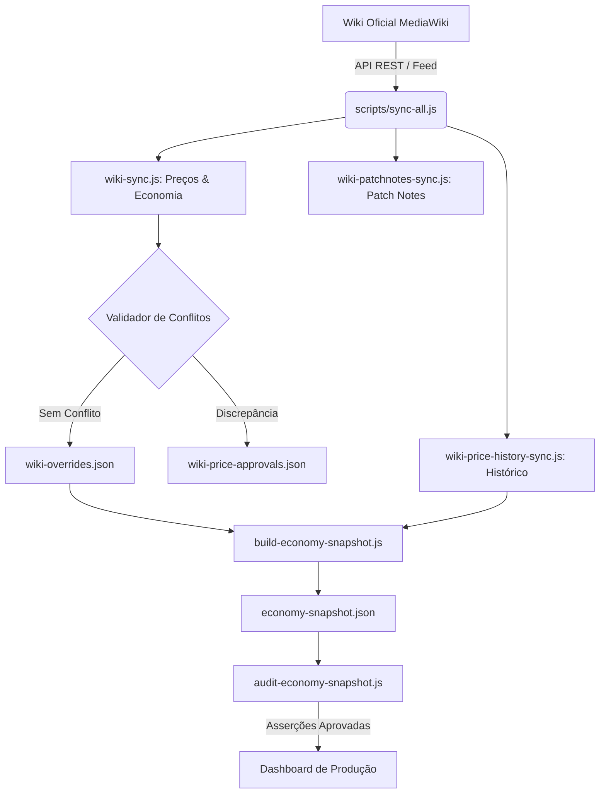

# 👑 AureumRO — Database & Economic Intelligence Suite

<div align="center">


**A primeira base de dados analítica de Ragnarok Online com inteligência macroeconômica, radar estatístico de emissão de Zeny, simulador patrimonial, motor de combate em tempo real e guias de progressão min-max.**

[](https://github.com/marlonhms/ROData)
[](https://github.com/marlonhms/ROData)
[](https://github.com/marlonhms/ROData)
[](https://github.com/marlonhms/ROData)
[](LICENSE)

[Explorar Funcionalidades](#-funcionalidades-principais) • [O Radar Econômico](#-o-radar-econômico-inédito) • [Modelagem Matemática](#-modelagem-matemática-e-estatística) • [Pipeline & Sincronização](#-pipeline-de-dados-e-sincronização-wiki) • [Como Executar](#-como-executar-localmente)

</div>

---

## 💡 Sobre o Projeto

As bases de dados tradicionais de Ragnarok Online (como *RateMyServer* ou *Divine-Pride*) limitam-se a catálogos estáticos de tabelas de monstros e itens. 

O **AureumRO Database & Intelligence Suite** foi projetado do zero para romper esse paradigma: é uma plataforma viva de engenharia de dados e inteligência estratégica. Além de fornecer fichas completas de monstros, mapas, drops e habilidades com precisão milimétrica, o sistema incorpora um **Motor Macroeconômico e Financeiro Determinístico** — uma inovação pioneira no ecossistema de MMORPGs que traduz o impacto do balanceamento de preços NPC, densidades de spawn e massa monetária circulante em **estatísticas acionáveis** para a tomada de decisão dos jogadores.

---

## 💎 O Radar Econômico Inédito

> ### *"Nenhuma outra database de MMORPG mede a capacidade estrutural de emissão de moeda do servidor com rigor estatístico."*

O **Radar Econômico** processa os spawns de todos os mapas do servidor, cruza com as taxas de drop de itens negociáveis em NPCs e avalia a série histórica de intervenções de balanceamento. Ele responde com precisão matemática às principais dúvidas econômicas de um jogador e de administradores:

1. **Onde está a maior pressão de geração de *Raw Zeny* do servidor?**
2. **Quais spots de farm são seguros contra *nerfs* e quais possuem risco iminente de desvalorização?**
3. **Qual é a concentração de riqueza estrutural nos mapas e drops?**
4. **Qual é o tamanho real do patrimônio de um jogador frente à massa monetária circulante?**
5. **Qual é a trajetória prevista da economia para os próximos 7 e 30 dias?**

```
 ┌─────────────────────────────────────────────────────────────────────────────┐
 │                           AUREUM ECONOMIC ENGINE                            │
 ├─────────────────┬──────────────────────┬─────────────────┬──────────────────┤
 │  Spawns & Drops │ Preços NPC & Overrides│  Massa Monetária │  Série Histórica │
 │ (Densidade Map) │    (Wiki Oficial)    │   Circulante    │   (Revisões rN)  │
 └────────┬────────┴──────────┬───────────┴────────┬────────┴─────────┬────────┘
          │                   │                    │                  │
          ▼                   ▼                    ▼                  ▼
 ┌─────────────────────────────────────────────────────────────────────────────┐
 │                         PIPELINE DE CÁLCULO ESTATÍSTICO                     │
 │   • Peso de Oferta Global       • Índice de Concentração HHI                │
 │   • Pressão de Emissão (Basket) • Review Pressure Score (Multi-fatorial)    │
 │   • Mediana de Choques Históricos • Forecast Determinístico (3 Cenários)     │
 └──────────────────────────────────────┬──────────────────────────────────────┘
                                        │
                                        ▼
 ┌─────────────────────────────────────────────────────────────────────────────┐
 │                        RADAR VISUAL & PAINEL DO JOGADOR                     │
 │   🛡️ Safe Farm Spots  ⚠️ Alerta de Risco  💎 Mercado P2P  🪙 Simulador Fatia │
 └─────────────────────────────────────────────────────────────────────────────┘
```

---

## 📐 Modelagem Matemática e Estatística

Todos os cálculos do painel são fundamentados em formulações matemáticas determinísticas e auditadas por testes de asserção automatizados ([`scripts/audit-economy-snapshot.js`](scripts/audit-economy-snapshot.js)).

### 1. Peso de Oferta e Pressão de Emissão de *Raw Zeny*

Para cada item $i$ catalogado no banco de dados, calcula-se o **peso de oferta no ecossistema** ($\text{SupplyWeight}_i$) multiplicando a chance de drop pela quantidade total de monstros que nascem em todos os mapas (excluindo MVPs para evitar distorções de farm contínuo):

$$\text{SupplyWeight}_i = \sum_{m \in \text{Mobs}} \left( \text{Chance}_{m, i} \times \sum_{k \in \text{Mapas}} \text{Spawn}_{m, k} \right)$$

A **Contribuição Bruta de Emissão** ($\text{RawContribution}_i$) traduz o potencial de Zeny injetado na economia por ciclo:

$$\text{RawContribution}_i = \text{PreçoNPC}_i \times \text{SupplyWeight}_i$$

A fatia de pressão estrutural de um item sobre a economia ($\text{SharePct}_i$) é expressa por:

$$\text{SharePct}_i = \frac{\text{RawContribution}_i}{\sum_{j} \text{RawContribution}_j} \times 100$$

---

### 2. Índice de Concentração Econômica (Herfindahl-Hirschman - HHI)

O sistema aplica a métrica clássica de teoria econômica **HHI** para calcular o nível de dependência que a economia do servidor tem de poucos itens ou mapas líderes de farm:

$$HHI = \sum_{i=1}^{N} \left( \frac{\text{RawContribution}_i}{\text{TotalContribution}} \times 100 \right)^2$$

* **Alta Concentração ($HHI \ge 2.500$):** A emissão de Zeny está altamente polarizada em pouquíssimos spots.
* **Concentração Moderada ($1.500 \le HHI \lt 2.500$):** Distribuição equilibrada com polos regionais de farm.
* **Distribuída ($HHI \lt 1.500$):** Geração diversificada por múltiplos ecossistemas do jogo.

---

### 3. Algoritmo de Score de Risco de Revisão (*Review Pressure Score*)

Para classificar quais itens apresentam desbalanceamento e estão sob iminente pressão de reajuste pelos administradores, o sistema combina quatro pilares fundamentais com **normalizações por raiz quadrada** (para suavizar distribuições de cauda longa) e **escala logarítmica** (para preços NPC):

$$\begin{aligned}
S_{\text{pressão}} &= \sqrt{\frac{\text{RawContribution}_i}{\max(\text{RawContribution})}} \times 100 \\
S_{\text{oferta}} &= \sqrt{\frac{\text{SupplyWeight}_i}{\max(\text{SupplyWeight})}} \times 100 \\
S_{\text{histórico}} &= \min\left(100, \text{AlteraçõesPassadas}_i \times 45\right) \\
S_{\text{preço}} &= \frac{\ln(1 + \text{PreçoNPC}_i)}{\ln(1 + \max(\text{PreçoNPC}))} \times 100
\end{aligned}$$

A **Pontuação Composta do Radar** ($\text{Score}_i \in [0, 100]$) é obtida pela média ponderada:

$$\text{Score}_i = 0{,}45 \cdot S_{\text{pressão}} + 0{,}25 \cdot S_{\text{oferta}} + 0{,}20 \cdot S_{\text{histórico}} + 0{,}10 \cdot S_{\text{preço}}$$

#### Categorização Inteligente:
* **🛡️ Farm Seguro ($\text{Score} \lt 50$):** Itens estáveis, com preço consolidado e baixíssimo risco de intervenção administrativa.
* **👀 Zona Monitorada ($50 \le \text{Score} \lt 65$):** Itens com geração relevante, sob observação de rotatividade.
* **⚠️ Alerta de Risco ($\text{Score} \ge 65$):** Spots hiper-eficientes onde a injeção de Zeny é desproporcional à média do servidor; alto risco de redução de preço futuro.

---

### 4. Projeções Preditivas e Cenários de Choque (*Forecast a 7 e 30 Dias*)

O modelo preditivo analisa a série temporal de revisões da Wiki oficial, identifica a **mediana estatística dos choques de redução histórica** ($\text{ChoqueMediano}$):

$$\text{ChoqueMediano} = \text{mediana}\left(\{ \Delta\% \mid \Delta\% \lt 0 \}\right)$$

Com base nisso e na cadência observada entre revisões ($\text{CadênciaDias}$), o motor calcula **três cenários determinísticos**:

| Cenário | Direção | Premissa de Projeção | Projeção D+7 | Projeção D+30 |
| :--- | :---: | :--- | :---: | :---: |
| **Restritivo** | 🔻 Deflacionário | Nova intervenção focal nos itens líderes com magnitude igual à mediana histórica | $I_0 \cdot \left(1 + \frac{\text{ChoqueMediano}}{200}\right)$ | $I_0 \cdot \left(1 + \frac{\text{ChoqueMediano}}{100}\right)$ |
| **Neutro / Estável** | ⏸️ Estabilidade | Manutenção das tabelas atuais de preços NPC | $I_0$ | $I_0$ |
| **Expansionista** | 🔺 Inflacionário | Abertura de novas fontes de farm ou valorização de subprodutos | $I_0 \cdot \left(1 + \frac{\text{Expansão}}{200}\right)$ | $I_0 \cdot \left(1 + \frac{\text{Expansão}}{100}\right)$ |

O **Índice de Confiança do Forecast** ($\text{Score}_{\text{confiança}} \in [0, 100]$) é auditado dinamicamente:

$$\text{Score}_{\text{confiança}} = 20 + \min\left(30, \frac{N_{\text{revisões}}}{16} \times 30\right) + \min\left(20, \frac{\text{DiasObservados}}{180} \times 20\right) + \text{TaxaRecorrência} + \text{BônusConsistência}$$

---

### 5. Massa Monetária e Simulador de Posição Patrimonial

O sistema integra a medição oficial da liquidez circulante do servidor ($\text{MassaTotal}$, em bilhões de Zeny):

$$\text{FatiaGlobal} = \frac{\text{Zeny do Jogador}}{\text{MassaTotal Circulante}} \times 100$$

As faixas patrimoniais recalibram suas participações dinamicamente com base na massa monetária total:

| Faixa Patrimonial | Saldo em Zeny | Fatia da Massa Total | Perfil Estratégico |
| :--- | :--- | :---: | :--- |
| **🌱 Iniciante** | Até 10.000.000 z | $\lt 0{,}20\%$ | Foco nas missões do Grupo do Éden e spots de farm estável. |
| **⚔️ Intermediário** | 10.000.000 z a 100.000.000 z | $0{,}20\% \text{ a } 2{,}02\%$ | Cartas essenciais, consumíveis de farm rápido e instâncias. |
| **🏛️ Próspero** | 100.000.000 z a 500.000.000 z | $2{,}02\% \text{ a } 10{,}13\%$ | Refinos avançados, Almas de Monstros raras e comércio P2P. |
| **👑 Magnata / Endgame** | Acima de 500.000.000 z | $\gt 10{,}13\%$ | Liderança econômica; financiamento de Torres e Godly Items. |

---

## 🛠️ Funcionalidades Principais

```
┌─────────────────────────────────────────────────────────────────────────────┐
│                               MODULOS DA SUÍTE                              │
├────────────────────────┬──────────────────────────┬─────────────────────────┤
│ 📊 Radar Econômico     │ 🐉 Database & Drops      │ ⚔️ Motor Min-Max        │
│ • Pressão de Emissão   │ • Ficha de Monstros      │ • Montador de Builds    │
│ • Previsões 7d/30d     │ • Catálogo de Itens      │ • Sistema de Almas      │
│ • Ranking Decisório    │ • Densidade em Mapas     │ • Guias Leveling 1-99   │
│ • Simulador de Riqueza │ • Coleção de Mapas       │ • Calculadora de DPS    │
└────────────────────────┴──────────────────────────┴─────────────────────────┘
```

### 1. 📊 Central Econômica & Farm Estratégico
* **Gráficos SVG Vetoriais Puros:** Séries históricas comparando o valor da Cesta NPC e o Índice de Pressão de Emissão desde a revisão *baseline*.
* **Radar do Jogador em 5 Dimensões:** *🛡️ Farm Seguro*, *⚠️ Alerta de Risco*, *💎 Mercado P2P*, *⚓ Sumidouros de Zeny* e *🧭 Rotas de Leveling*.
* **Ranking Decisório Cenarizado:** Alterne instantaneamente entre os cenários *Restritivo*, *Neutro* e *Expansionista* para ver como a prioridade dos itens se reorganiza.
* **Auditabilidade Completa:** Todas as mudanças por revisão possuem registro com data, justificativa oficial e variação absoluta e percentual.

### 2. 🐉 Enciclopédia & Database
* **Monstros:** Estatísticas de combate completas (HP, DEF, MDEF, ATK, Esquiva necessária para 95%, Precisão para 100%, Elemento, Raça e Tamanho).
* **Drops & Spawns:** Tabela de drops com chances exatas e localização de todos os monstros com contagem de respawn por mapa.
* **Onde Farmar:** Motor de busca invertida — digite o nome de um item e receba os melhores monstros e mapas ordenados por densidade populacional e facilidade de farm.
* **Comparador de Mobs:** Análise comparativa lado a lado para benchmarking de eficiência de caça.

### 3. ⚔️ Min-Max Builds & Motor de Efeitos
* **Character Studio Completo:** Monte e compartilhe builds com Atributos (STR, AGI, VIT, INT, DEX, LUK), Equipamentos (Topo, Meio, Baixo, Armadura, Arma, Escudo, Capa, Calçado, Acessórios), Cartas e **Almas de Monstros**.
* **Motor de Efeitos de Personagem ([`character-effects.js`](character-effects.js)):** Parser determinístico que lê descrições de equipamentos, calcula atributos derivados, aplica bônus condicionais e audita a cobertura de efeitos.
* **Guias de Leveling 1-99 Integrados ([`leveling-guides.js`](leveling-guides.js)):** Rotas táticas de evolução divididas em 5 fases para todas as 16 classes, com prioridade de stats, spots recomendados e integração side-by-side no painel de builds.

---

## 🔄 Pipeline de Dados e Sincronização Wiki

O projeto possui um pipeline automatizado de ingestão e auditoria de dados:



### Comandos de Sincronização e Auditoria:

```bash
# Executa a esteira completa com 1 comando (Patch Notes -> Preços -> Histórico -> Snapshot -> Auditorias)
node scripts/sync-all.js

# Ou simplesmente dê dois cliques no arquivo:
./sincronizar-tudo.bat
```

---

## ☁️ Arquitetura Serverless & Votação Comunitária

Para os painéis de engajamento da comunidade (como a avaliação de patch notes), o projeto utiliza uma arquitetura *edge-first*:

* **Cloudflare Workers:** API serverless de latência ultra-baixa para processamento de votos.
* **Cloudflare D1:** Banco de dados SQL distribuído na borda, com armazenamento anônimo via hash criptográfico (`voter_hash` com *salt* único).
* **Cloudflare Turnstile:** Proteção anti-bot invisível que valida a humanidade da requisição sem degradar a UX.
* **Cloudflare Web Analytics:** Telemetria de privacidade preservada sem cookies.

---

## ⚡ Filosofia Zero-Build & Performance

* **Zero Build Steps:** Sem Webpack, Vite, Babel ou Node em runtime. Abra o `index.html` e a aplicação está rodando na velocidade máxima da luz.
* **Renderização Vetorial Nativa:** Gráficos de séries temporais gerados dinamicamente em SVG através de matemática matricial pura no navegador, sem bibliotecas pesadas de terceiros (como Chart.js ou D3).
* **Camada de Overrides Não-Destrutiva:** O `db.json` original de monstros e itens permanece imutável; atualizações de balanceamento da Wiki são aplicadas como uma camada virtual (`wiki-overrides.json`), permitindo rollback instantâneo e rastreabilidade total.

---

## 🚀 Como Executar Localmente

Como o front-end é estático e ultra-otimizado, basta servi-lo com qualquer servidor web HTTP:

### 1. Clonar o Repositório
```bash
git clone https://github.com/marlonhms/ROData.git
cd ROData
```

### 2. Iniciar Servidor Local
```bash
# Via Node.js (npx)
npx serve .

# Ou via Python 3
python -m http.server 8000

# Ou via extensão Live Server do VS Code
```
Acesse `http://localhost:3000` (ou `http://localhost:8000`) no navegador.

### 3. Rodar a Suíte de Auditoria e Testes
```bash
node scripts/test-character-effects.js
node scripts/audit-character-effects.js
node scripts/audit-soul-effects.js
node scripts/audit-economy-snapshot.js
node scripts/audit-price-history.js
```

---

## 📜 Metodologia & Transparência

> **Nota Metodológica:** Os indicadores do Radar Econômico medem a **capacidade estrutural de geração de Zeny em NPCs** com base nos arquivos do jogo e revisões oficiais. Eles representam modelagem analítica e não constituem anúncio oficial, promessa de mercado ou garantia de cotação em negociações diretas entre jogadores.

---

<div align="center">

**AureumRO Database Suite** • Desenvolvido com rigor estatístico, foco em usabilidade e carinho para a comunidade.

© 2026 Marlon Henrique Serpa • [GitHub Repository](https://github.com/marlonhms/ROData)

</div>
